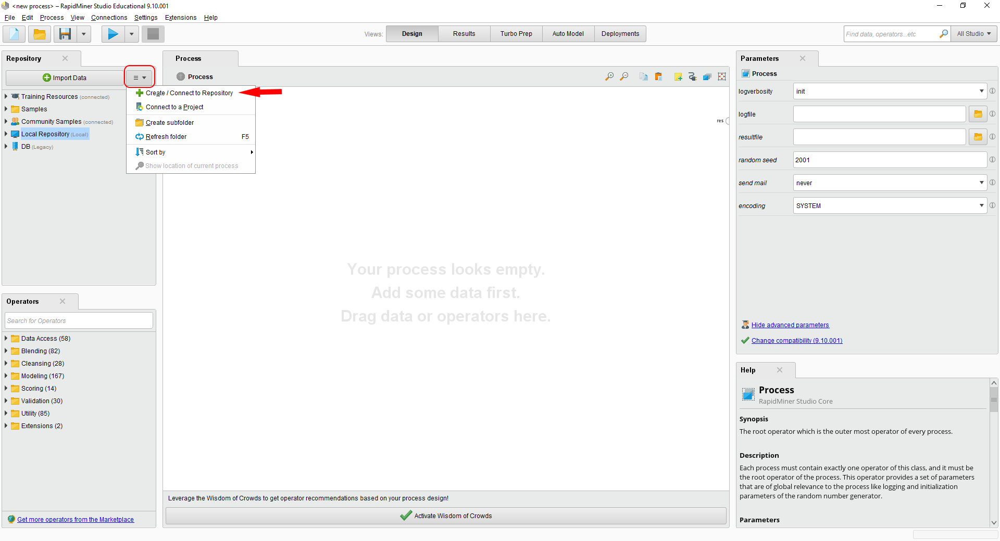
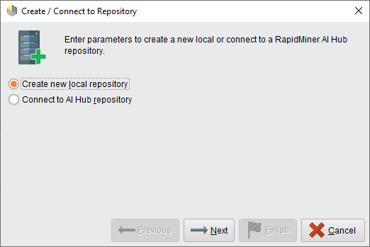
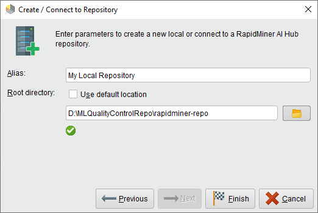
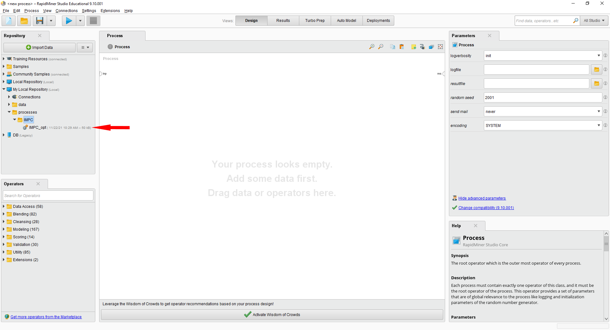
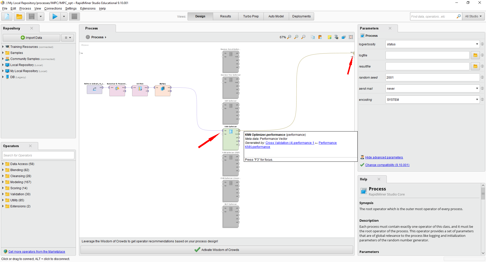
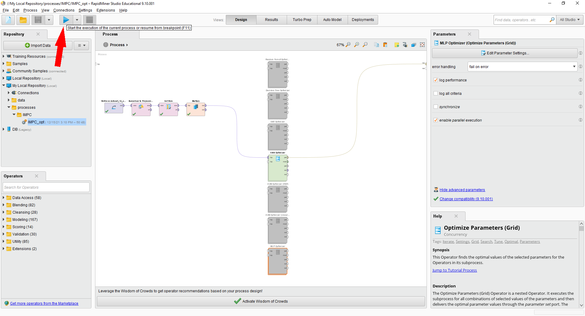
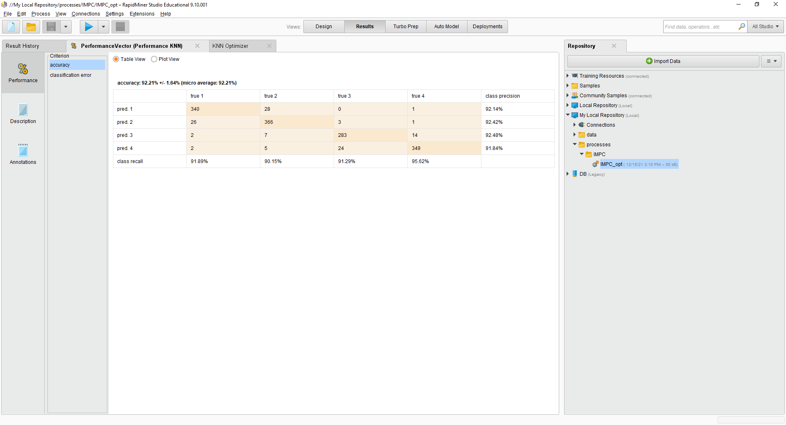

# Machine Learning for Quality Prediction in Plastic Injection Molding

This repository contains the source code and the data of the experiments presented in the paper

>A. Polenta, S. Tomassini, N. Falcionelli, P. Contardo, A.F. Dragoni, P. Sernani, *Machine learning for quality prediction in plastic injection molding: a comparison on a real case study*.

The paper is currently under review for the publication in the [Computers and Industrial Engineering](https://www.journals.elsevier.com/computers-and-industrial-engineering) journal.

Specifically, **the experiments are implemented in Rapid Miner** and compare **six Machine Learning (ML) techniques** to predict the quality classes of plastic road lenses using the data of the process parameters collected from the molding machine during the production. To this end, the repository is composed of the following directories:

- [dataset](dataset/), including a CSV file ("data.csv") with the process parameters of 1451 road lenses, produced by the company "iGuzzini Illuminazione" (located in Recanati, Italy) during five different production days. Each row represents the feature vector composed of 13 process parameters of a lens, plus its quality label.

- [rapidminer-repo](rapidminer-repo/), including the local repository of Rapid Miner with the process and data to execute the experiments comparing six ML techniques for the quality prediction of the plastic road lenses. The compared techniques are K-Nearest Neighbors (KNN), Decision Tree, Random Forest, Gradient Boosted Trees (GBT), Support Vector Machine (SVM), and Multi-Layer Perceptron (MLP).

- [results](results/), including a spreadsheet ("Results.ods") with the results got by each classifier in the quality prediction of the 1451 plastic road lenses available in the dataset, using a stratified 5-fold cross validation scheme.

- [images](images/), including the images used in this readme file.

## Data Description

The [dataset/data.csv](dataset/data.csv) file includes 1451 feature vectors corresponding to **1451 plastic road lenses** produced in iGuzzini Illuminazione in five different production days, namely the 18th, 19th, and 20th of September 2019, the 7th of February 2020, and the 20th of May 2020. Each feature vector includes **13 injection molding process parameters**, listed in the following table.

| Feature                                    | Unit           | Description                                                     |
| ------------------------------------------ | -------------- | --------------------------------------------------------------- |
| Melt temperature                           | &deg;C         | Temperature of the polymer before the injection in the mold     |
| Mold temperature                           | &deg;C         | Temperature of the mold                                         |
| Filling time                               | s              | Time to fill the mold                                           |
| Plasticizing time                          | s              | Time to plasticize the product                                  |
| Cycle time                                 | s              | Time to complete the entire process for a product               |
| Closing force                              | N              | Closing force of the mold                                       |
| Clamping force peak value                  | N              | Peak value of the closing force of the mold                     |
| Torque peak value current cycle            | N&middot;m     | Peak value of the torque on the injection screw                 |
| Torque mean value current cycle            | N&middot;m     | Mean value of the torque on the injection screw                 |
| Specific back pressure peak value          | Bar            | Peak value of the resistance of the injection screw             |
| Specific injection pressure peak value     | Bar            | Peak value of the injection pressure                            |
| Screw position at the end of hold pressure | Cm             | Position of the injection screw at the end of the holding cycle |
| Shot volume                                | Cm3 | Injection volume                                                |

The data was produced by the "[Engel E-MAC 310/100](https://www.engelglobal.com/en/us/index.html)" injection machine and collected by the ["TIG" Manufacturing Execution System (MES)](https://www.tig-mes.com/en/).

The CSV file includes **an extra column with the label** identifying the quality class of each sample. Given that the standard "UNI EN 13201-2:2016" imposes a general uniformity U0 greater than 0.4 for M1 lenses in motorized roads, we defined the following four quality classes, for the samples of the dataset:

- **Waste**, with U0 &lt; 0.4. All the samples that exhibit a general uniformity less than 0.4 in the photometric analysis should be discarded, as they are not compliant to the standard. The label for this class is **1**.

- **Acceptable**, with 0.4 &le; U0 &lt; 0.45. All the samples with a uniformity greater or equal than 0.4 and less than 0.45 are considered acceptable by iGuzzini Illuminazione, as they comply with the standard. However, the target for the iGuzzini production is an higher quality. The label for this class is **2**.

- **Target**, with 0.45 &le; U0 &le; 0.5. All the samples with a uniformity greater or equal than 0.45 and less or equal than 0.5 are considered optimal by the company. The label for this class is **3**.

- **Inefficient**, with U0 &gt; 0.5. Even if the general uniformity is way greater than the standard threshold, producing lenses with a uniformity greater than 0.5 would result in the molding machine using more resources, and therefore this quality should be avoided, as it is not required. The labels for this class is **4**.

The following table summarizes the number of samples included in each class.

|                     | Waste | Acceptable | Target | Inefficient |
| :-----------------: | :---: | :--------: | :----: | :---------: |
| **Label**           | 1     | 2          | 3      | 4           |
| **No. of samples**  | 370   | 406        | 310    | 360         |

## Importing the classifiers in RapidMiner Studio

The six ML classifiers tested in the paper, namely K-Nearest Neighbor (KNN), Decision Tree, Random Forest, Gradient Boosted Trees (GBT), Support Vector Machine (SVM), and Multi-Layer Perceptron (MLP) are implemented in [RapidMiner Studio 9.10](https://rapidminer.com/). The process [rapidminer-repo/processes/IMPC/IMPC_opt.rmp](rapidminer-repo/processes/IMPC/IMPC_opt.rmp) implements a stratified 5-fold cross validation scheme to find the best hyperparameter configuration for each classifier and collect accuracy metrics. In the following we provide the instructions to import the data and the process in RapidMiner Studio 9.10.

### Import local repository

To import the data and the process with the experiments of the six classifier, create a local repository in RapidMiner studio.

  

Select **Create new local repository** on the prompt and make it point to the **rapidminer-repo** directory placed in the directory where you downloaded this GitHub repository.

  

  

### Open Experiment Process

Once the local repository directory is set, open the IMPC_opt process in the "processes/IMPC" directory.

  

The process retrieves the dataset from the data directory, sets the label from the dataset last column and feeds the optmizer of the tested classifiers.

  

### Run Tests

To test the classifiers, just connect the **multiply block output** to a **classifier optimizer input** and the optmizer **performance output** to the **results**. Enable the connected optimizer only and disable all the other optimizer blocks, as in the following example.

  

To run the tests, **press the play button** on the top left bar of Rapid Miner studio

  

Once the tests with a classifier ended, you can read the results under the **"Results" view**. The generated confusion matrix includes the results of the combination of hyperpameters with the best accuracy. The confusion matrix sums up the results obtained in each fold of a **5-fold cross validation scheme**.

  

## Experiment Results
The [results/Results.ods](results/Results.ods) file includes the results of the tested classfiers. For each classifier, the results for **each combination of hypermeters** and **the confusion matrix related to the best combination** are reported.